## <center>一步步深入了解S-MSCKF</center>
<p align="right">作者:钟心亮</p>
<p align="right">联系方式:xinliangzhong@foxmail.com</p>

[TOC]

### 0.前言

　　#### 0.1 我为什么写这个?

　　一方面是对自己看过的东西做一个简单的总结,之前也看过一些其他的,但都没有系统的成文,因为时间比较紧张, 科研压力比较大.另外一方面是向各位大佬们学习,希望能得到大佬们的指导, 同时希望对刚入门SLAM和已经入门一段时间的SLAM小伙伴一点干货. 结交一些志同道合的小伙伴!

#### 0.2 可爱的您能得到什么?

　　如果您正在研究MSCKF或者对VIO很感兴趣,那么您将得到以下几件东西:

(1) [一份看了不会亏的MSCKF的入门指南](http://www.xinliang-zhong.com/msckf_notes/)

(2) 基本我自己推导过的一本书(或者叫比较长的论文) [Quaternion kinematics for the error-state Kalman filter](https://github.com/TurtleZhong/msckf_mono)

(3) [一份注释过的开源版本的代码](https://github.com/TurtleZhong/msckf_mono)

　　如果您是已经最MSCKF及其熟悉的大佬,那么您将得到:

其实我也还没想好您能得到什么,我倒是很想从您那得到一些东西...

#### 0.3 我希望可爱的您反馈什么?

(1) 全文一些描述有误的地方,因为自己写东西比较随意,难免有大家理解起来有问题或者本身就描述不对的地方.

(2) 反馈网址戳 [这里](https://github.com/TurtleZhong/msckf_mono/issues), 可爱的您一定会随手在github留下小星星对不对? 不方便公共留言的话可以邮箱私聊我.

(3) 交个朋友? 江湖有缘相见. 祝可爱的您科研顺利,一夜暴富!!!

### 1.简介

　　MSCKF (Multi-State Constraint Kalman Filter),从2007年提出至今,一直是filter-based SLAM比较经典的实现.据说这也是谷歌tango里面的算法，这要感谢Mingyang Li博士在MSCKF的不懈工作。在传统的EKF-SLAM框架中，特征点的信息会加入到特征向量和协方差矩阵里,这种方法的缺点是特征点的信息会给一个初始深度和初始协方差，如果不正确的话，极容易导致后面不收敛，出现inconsistent的情况。MSCKF维护一个pose的FIFO，按照时间顺序排列，可以称为滑动窗口，一个特征点在滑动窗口的几个位姿都被观察到的话，就会在这几个位姿间建立约束，从而进行KF的更新。如下图所示, 左边代表的是传统EKF SLAM, 红色五角星是old feature,这个也是保存在状态向量中的,另外状态向量中只保存最新的相机姿态; 中间这张可以表示的是keyframe-based SLAM, 它会保存稀疏的关键帧和它们之间相关联的地图点; 最右边这张则可以代表MSCKF的一个基本结构, MSCKF中老的地图点和滑窗之外的相机姿态是被丢弃的, 它只存了滑窗内部的相机姿态和它们共享的地图点.

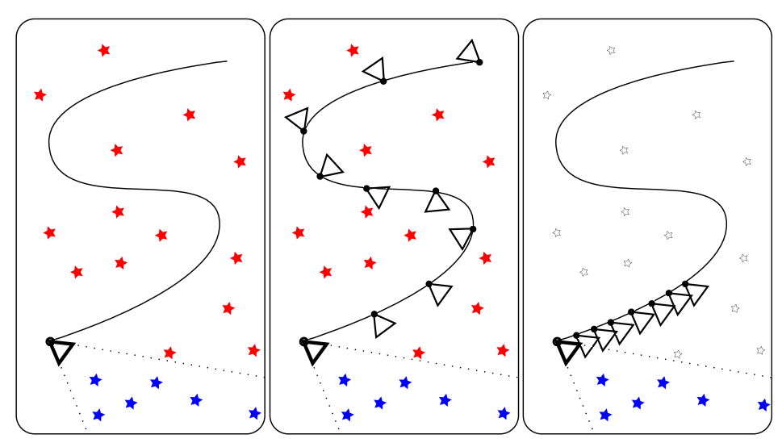

#### 符号说明
$\dot{\textbf{x}}$ 表示微分

$\tilde{\textbf{x}}$ 表示误差

$\hat{\textbf{x}}$ 表示估计值

$\textbf{x}_{m}$ 表示测量值

$G$ 惯性系

$C$ 相机坐标系

$I$ IMU坐标系

$^{G}\textbf{p}$ $G$系下的一个点

$^{B}_{A}\textbf{R}$  从$A$系到$B$系的旋转矩阵

### 2.前端
　　本文主要针对2017年Kumar实验室开源的S-MSCKF进行详细分析,其实这篇文章整体思路与07年提出的基本上是一脉相承的.作为一个VIO的前端,MSCKF采用的是光流跟踪特征点的方法,特征点使用的是FAST特征,另外这是MSCKF双目的一个实现,双目之间的特征点匹配采用的也是光流,这与传统的基于descriptor匹配的方法不同.前端部分其实相对简单,整个前端部分基本在 **[image_processor.cpp](https://github.com/KumarRobotics/msckf_vio/blob/master/src/image_processor.cpp)**中实现.

#### 2.1 基本数据结构说明

##### A.特征点检测和跟踪的参数

```c++
  struct ProcessorConfig {
    int grid_row;				//划分图像网格的行数
    int grid_col;				//划分图像网格的列数
    int grid_min_feature_num;	//每个网格特征点的最小个数
    int grid_max_feature_num;	//每个网格特征点的最大个数

    int pyramid_levels;			//金字塔层数
    int patch_size;				
    int fast_threshold;
    int max_iteration;
    double track_precision;
    double ransac_threshold;
    double stereo_threshold;
  };
```

##### B. 特征点数据

```c++
  struct FeatureMetaData {
    FeatureIDType id;		//unsigned long long int 每个特征都有单独的ID
    float response;			//Feature的响应值
    int lifetime;			//Feature的生存周期
    cv::Point2f cam0_point; //Feature在左相机的图像坐标
    cv::Point2f cam1_point; //Feature在右相机的图像坐标
  };
```

#### 2.2 跟踪流程

　　整体框架如下面的流程图所示:

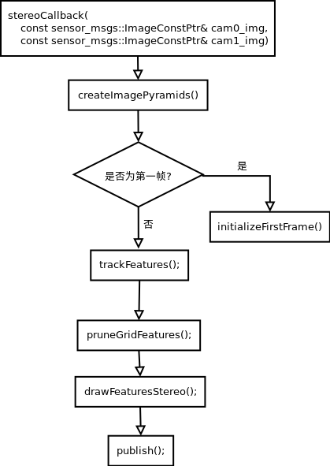

##### 2.2.1 Initialization 
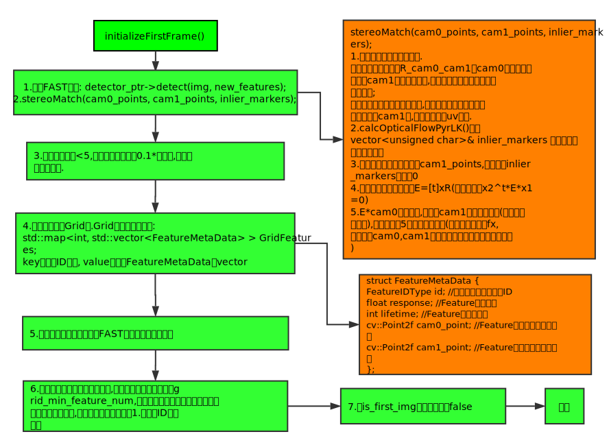
##### 2.2.2 trackFeatures

　　当第一帧初始化完成之后,后面帧则只需要进行跟踪第一帧的特征点,并且提取新的特征点,整个流程如下:

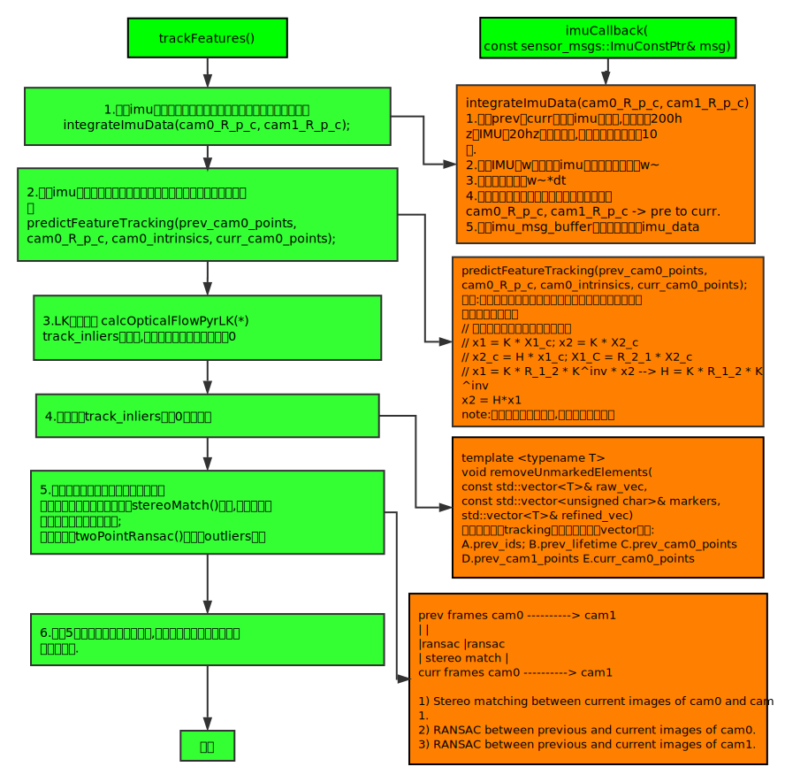

　　整个流程还算比较清晰,但是有一个步骤需要单独说明一下,也就是作者在论文中提到的twoPointRansac的方法.我们先来看一下函数原型:

```C++
/**
 * @brief 计算原图像帧关键点对应的矫正位置
 * @param pts1：上一时刻的关键点位置
 * @param pts2:当前时刻跟踪匹配到的关键点位置
 * @param R_p_c:根据imu信息计算得到的两个时刻相机的相对旋转信息
 * @param distortion_model,intrinsics：相机内参和畸变模型
 * @param inlier_error：内点可接受的阈值（关键点距离差）
 * @param success_probability：成功的概率
 * @return inlier_markers：内点标志位
 */
void ImageProcessor::twoPointRansac(
    const vector<Point2f>& pts1, const vector<Point2f>& pts2,
    const cv::Matx33f& R_p_c, const cv::Vec4d& intrinsics,
    const std::string& distortion_model,
    const cv::Vec4d& distortion_coeffs,
    const double& inlier_error,
    const double& success_probability,
    vector<int>& inlier_markers)
```
整个函数的基本流程如下:
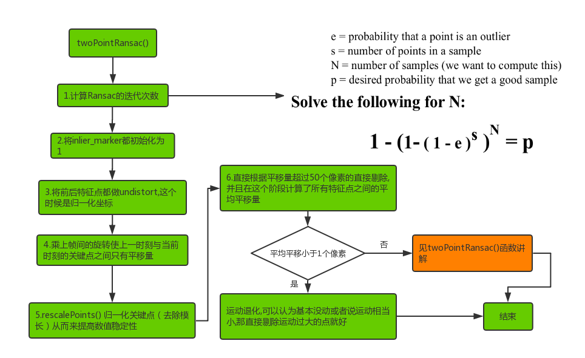
下面我们来详细讲解一下RANSAC模型及原理依据:
我们由对极几何可以知道有以下约束:
$$
p_{2}^{T}\cdot [t]_{x}\cdot R\cdot p_{1}=0
\tag{2.1}
$$
我们假设前后帧对应点归一化坐标分别为,
$$
R\cdot p_{1}=\begin{bmatrix}
x{1} & y{1} & 1
\end{bmatrix}^{T},
p_{2}=\begin{bmatrix}
x{2} & y{2} & 1
\end{bmatrix}^{T}
\tag{2.2}
$$
其中R为根据IMU的平均角速度得到的,此时坐标系都统一到一个坐标系下.
$$
\begin{bmatrix}
 x_{2}& y_{2} & 1 
\end{bmatrix}
\cdot \begin{bmatrix}
0 & -t_{z} & t_{y}\\ 
t_{z} & 0 & -t_{x}\\ 
-t_{y} & t_{x} & 0
\end{bmatrix}
\cdot \begin{bmatrix}
x_{1}\\ 
y_{1}\\ 
1
\end{bmatrix}=0
\tag{2.3}
$$

将式子(2.3)展开之后我们可以得到:
$$
{\color{Green} \begin{bmatrix}
y_{1}-y_{2} & -(x_{1}-x_{2}) & x_{1}y_{2}-x_{2}y_{2}
\end{bmatrix}}\cdot 
\begin{bmatrix}
t_{x}\\ 
t_{y}\\ 
t_{z}
\end{bmatrix}=0
\tag{2.4}
$$
其中绿色部分在代码中对应这一块:

```c++
vector<Point2d> pts_diff(pts1_undistorted.size());
  for (int i = 0; i < pts1_undistorted.size(); ++i)
    pts_diff[i] = pts1_undistorted[i] - pts2_undistorted[i];
...  
...
MatrixXd coeff_t(pts_diff.size(), 3);
  for (int i = 0; i < pts_diff.size(); ++i) {
    coeff_t(i, 0) = pts_diff[i].y;
    coeff_t(i, 1) = -pts_diff[i].x;
    coeff_t(i, 2) = pts1_undistorted[i].x*pts2_undistorted[i].y -
      pts1_undistorted[i].y*pts2_undistorted[i].x;
  }
```

至于这个模型是怎么选出来的呢? 假设一共有N个inliers点对,那么根据式(2.4)势必会得到一个N*3 * 3*1 = N(0)的等式.但事实上由于误差和outliers的存在,最终结果不可能为零,我们取两个点将式子分块,并且只考虑两个点的情况,那么将会有:
$$
{\color{Green} \begin{bmatrix}
y_{1}-y_{2} & -(x_{1}-x_{2}) & x_{1}y_{2}-x_{2}y_{2}\\
y_{3}-y_{4} & -(x_{3}-x_{4}) & x_{3}y_{4}-x_{4}y_{3}
\end{bmatrix}}
\cdot 
\begin{bmatrix}
t_{x}\\ 
t_{y}\\ 
t_{z}
\end{bmatrix}=
{\color{Green} \begin{bmatrix}
A_{x} \\ A_{y} \\ A_{z}
\end{bmatrix}^{T}}
\cdot 
\begin{bmatrix}
t_{x}\\ 
t_{y}\\ 
t_{z}
\end{bmatrix}\approx
{\color{Red} 
\begin{bmatrix}
0\\ 
0
\end{bmatrix}}
\tag{2.5}
$$
那我们可以分别得到以下三个式子:
$$
\begin{split}
\begin{bmatrix}
A_{x} \\ 
A_{y}
\end{bmatrix}^{T}
\cdot
\begin{bmatrix}
t_{x} \\ 
t_{y}
\end{bmatrix}
\approx {\color{Green}A_{z}}\cdot t_{z} \\
\begin{bmatrix}
A_{x} \\ 
A_{z}
\end{bmatrix}^{T}
\cdot
\begin{bmatrix}
t_{x} \\ 
t_{z}
\end{bmatrix}
\approx {\color{Green}A_{y}}\cdot t_{y} \\

\begin{bmatrix}
A_{y} \\ 
A_{z}
\end{bmatrix}^{T}
\cdot
\begin{bmatrix}
t_{y} \\ 
t_{z}
\end{bmatrix}
\approx {\color{Green}A_{x}}\cdot t_{x} 
\end{split}\tag{2.6}
$$
　　我们的目标当然是使得误差最小,所以作者的做法是比较式子(2.6)绿色部分的大小,取最小的并令模型的平移为1,进而直接求逆然后得到最初的模型假设,之后要做的步骤跟常规RANSAC就十分接近了,找出适应当前模型的所有inliers,然后计算误差并不断迭代找到最好的模型.
　　至此我们已经完成了整个feature的tracking过程!

##### 2.2.3 addNewFeatures & pruneGridFeatures

　　如果一直tracking的话那么随着时间流逝,有些特征会消失,有些可能也会有累计误差,所以我们势必要添加一些新的特征,这个步骤正是在跟踪上一帧特征之后要做的,因为stereoMatching 和twoPointRansac都会剔除一些outliers,那我们需要提取新的特征保证能一直运行下去.

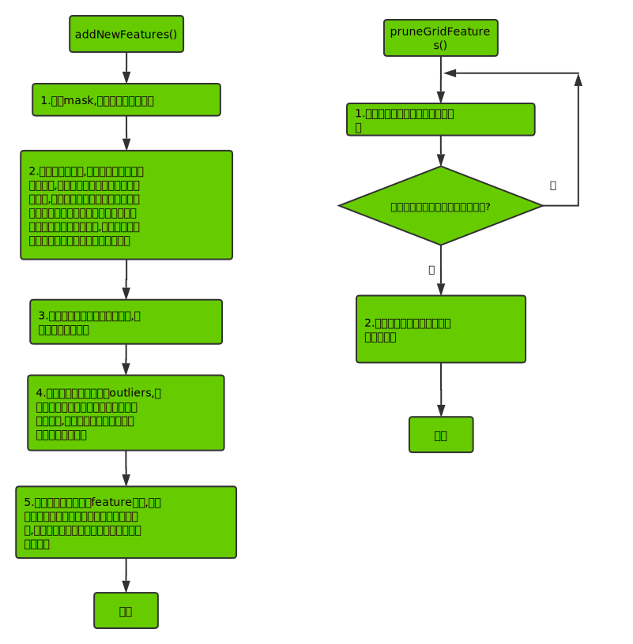

##### 2.2.4 publish

　　主要发布了当前帧特征点的数据,每个特征的数据结构为FeasureMeasurement如下:

```c++
uint64 id
# Normalized feature coordinates (with identity intrinsic matrix)
float64 u0 # horizontal coordinate in cam0
float64 v0 # vertical coordinate in cam0
float64 u1 # horizontal coordinate in cam0
float64 v1 # vertical coordinate in cam0
```

发布的其实是CameraMeasurement,那其实就是一个包含上面特征数据FeasureMeasurement的一个数组.

#### 2.3 显示
其实前端基本上可以说是非常简单了,也没有太多的trick,最后我们来看一下前端的跟踪效果的动图:

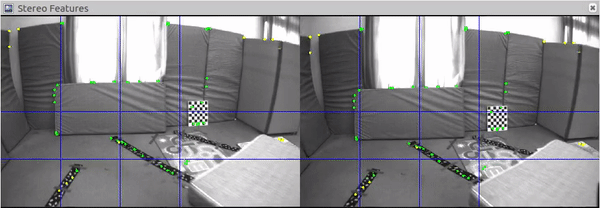

### 3.基于四元数的 error-state Kalman Filter

​	其实原理部分相当重要,包括你对error-state Kalman Filter的理解,但是如果要从头讲起的话可以说篇幅太长,考虑到做SLAM的同学们基本上都应该知道这本书 [Quaternion kinematics for the error-state Kalman filter](https://arxiv.org/abs/1711.02508), 这本书会让你在四元数,SO3,IMU的模型以及基于IMU的ESKF(error-state Kalman Filter)都会有比较深刻的理解,对应这本书我也做了很多注释,关于基于四元数原理部分由于篇幅限制,我这里不想做太多的说明,但是接下来在讲解S-MSCKF原理部分我们会将参考公式附上.下面是一些我在这本参考资料中的注释图.

| 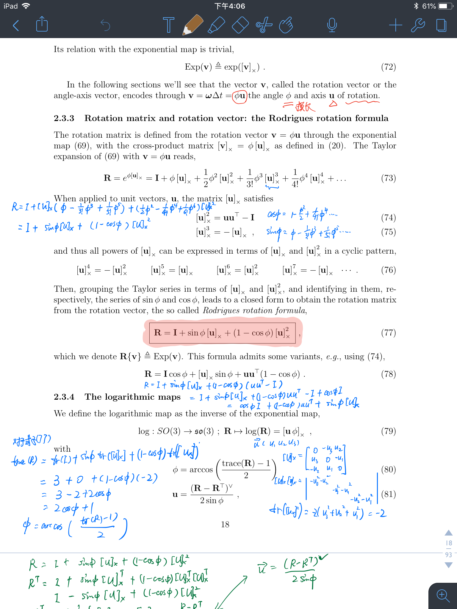 | 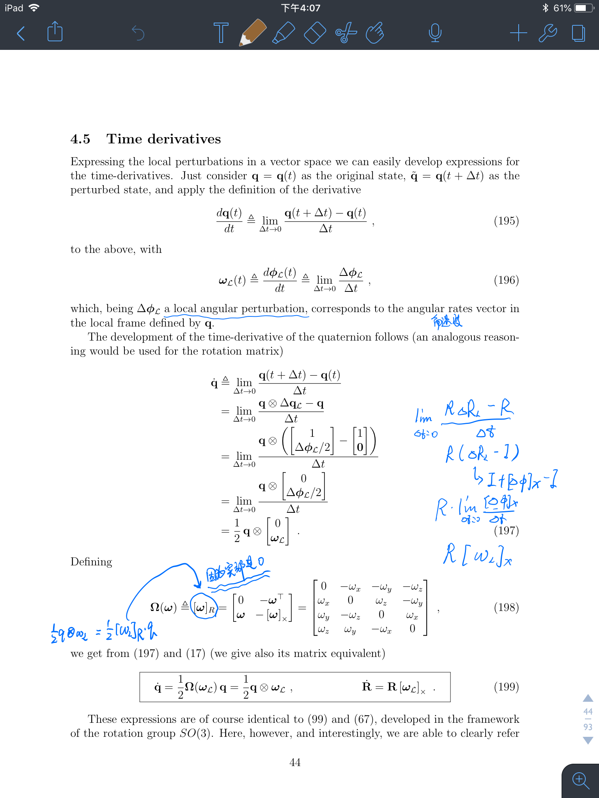 |
| :----------------------------------------------------------: | :----------------------------------------------------------: |
| 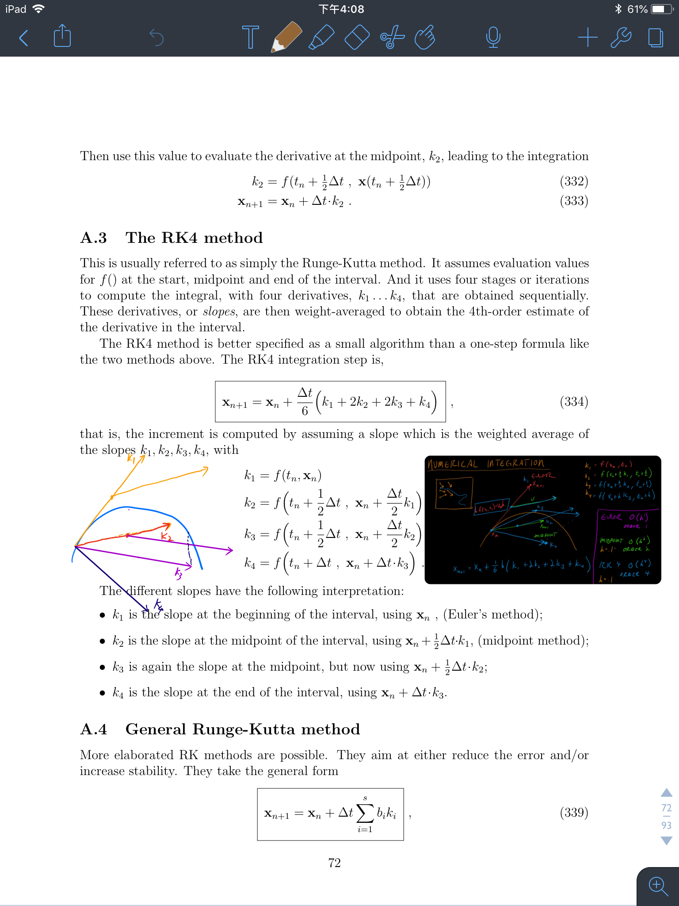 | 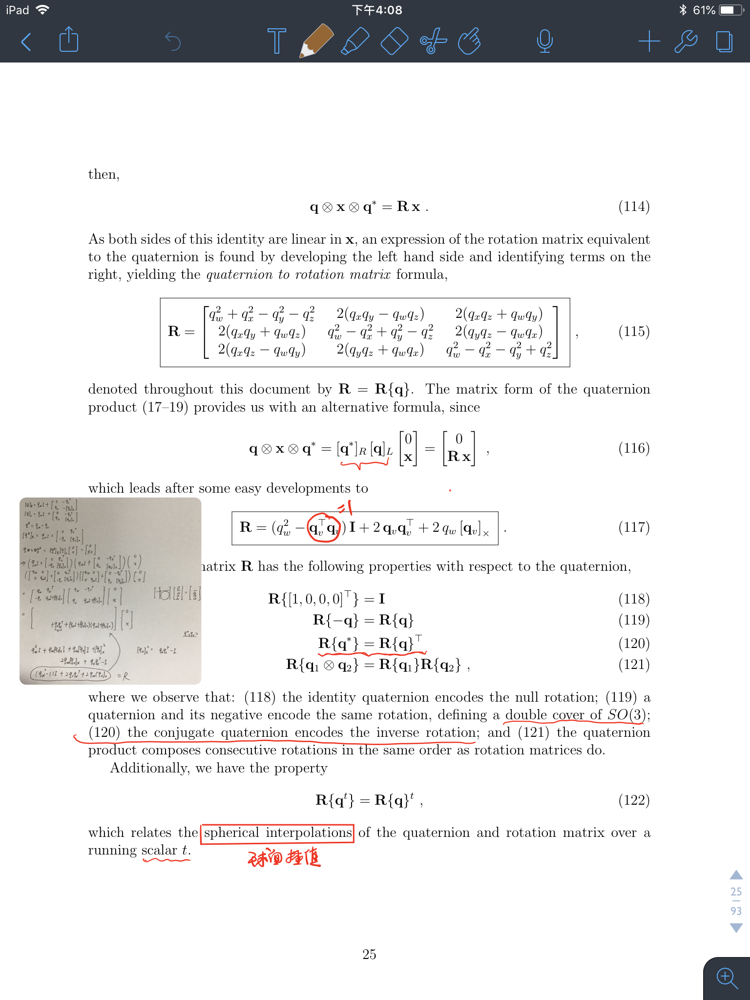 |

当然重要的事情需要说三遍,那就是[Quaternion kinematics for the error-state Kalman filter](https://arxiv.org/abs/1711.02508)四元数是Hamilton表示方法,而MSCKF中采用的是JPL表示方法,关于这两者的不同,可以参考书中34页,Table2.

　　看过论文代码的同学可能会说,MSCKF这一部分代码参考的是MARS实验室[Indirect Kalman Filter for 3D Attitude Estimation-A Tutorial for Quaternion Algebra](http://citeseerx.ist.psu.edu/viewdoc/download?doi=10.1.1.304.6207&rep=rep1&type=pdf),答案是肯定的.但是我的建议是以Hamilton那本书为基础,然后自行再去推导MARS出品那一本,那样你的体验会更加深刻.

### 4.S-MSCKF

#### 4.1 基本原理

　　在讲解之前,我们先来定义一下坐标系,如下图所示:
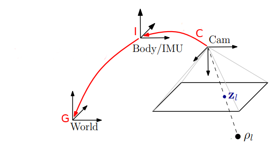

其中$I$表示IMU机体坐标系(Body Frame),$G$表示的是惯性系(Inertial Frame),$C$表示的是相机坐标系(Camera Frame).

​	作为一个滤波器,我们首先来看滤波器的状态向量,它包含两个部分,IMU状态和Camera状态:
$$
\textbf{x}_{I}=\begin{bmatrix}
_{G}^{I}\textbf{q}^{T} & \textbf{b}_{g}^{T} & ^{G}\textbf{v}_{I}^{T} & \textbf{b}_{a}^{T} & 
^{G}\textbf{p}_{I}^{T} & _{C}^{I}\textbf{q}^{T} & ^{I}\textbf{p}_{C}^{T} 
\end{bmatrix}^{T}
\tag{4.1}
$$
其中$_{G}^{I}\textbf{q}​$表示的是从惯性系到机体IMU系的旋转变换, $^{G}\textbf{v}_{I}​$和$^{G}\textbf{p}_{I}​$分别表示机体在惯性系下的速度和位置,$\textbf{b}_{g}​$和$\textbf{b}_{a}​$分别代表IMU的bias,而$_{C}^{I}\textbf{q}​$ 和$ ^{I}\textbf{p}_{C}​$分别代表从相机坐标系到IMU坐标系的旋转与平移,其中以左相机为准. 但是我们注意到旋转实际上只有三个自由度,而且四元数必须是单位单位四元数,那这样额外的约束会使得协方差矩阵奇异,所以我们定义error IMU状态如下:
$$
\tilde{\textbf{x}}_{I}=\begin{bmatrix}
_{G}^{I}\tilde{\theta }^{T} & \tilde{\textbf{b}}_{g}^{T} & ^{G}\tilde{\textbf{v}}_{I}^{T} & \tilde{\textbf{b}}_{a}^{T} & 
^{G}\tilde{\textbf{p}}_{I}^{T} & _{C}^{I}\tilde{\textbf{q}}^{T} & ^{I}\tilde{\textbf{p}}_{C}^{T} 
\end{bmatrix}^{T}
\tag{4.2}
$$

所以IMU的状态一共是$3\cdot7=21​$维向量,后6维度其实是相机与IMU的外参,这6个维度在MSCKF1.0版本是不在状态向量里边的. MSCKF的状态向量还包含另外一个组成部分,那就是N个相机的姿态,那么每个相机的姿态误差向量定义为 $\tilde{\textbf{x}}_{C_{i}}=\left (   \begin{matrix}_{G}^{C_{i}}\tilde{\theta }^{T} & ^{G}\tilde{\textbf{p}}_{C_{i}}^{T}\end{matrix} \right )^T​$,所以当滑窗里边有N个相机姿态的时候,整个误差状态向量为:
$$
\tilde{\textbf{x}} = \begin{pmatrix}
\tilde{\textbf{x}}_{I}^{T} & \tilde{\textbf{x}}_{C_{1}}^{T} & ... & \tilde{\textbf{x}}_{C_{N}}^{T}
\end{pmatrix}
\tag{4.3}
$$
我们以标准error-state KF为准,其过程包含运动模型和观测模型.

　　##### A.运动模型

我们知道对于IMU的状态连续时间的运动学有:
$$
\begin{split}
_{G}^{I}\dot{\hat{\textbf{q}}}=\frac{1}{2}\cdot_{G}^{I}\hat{\textbf{q}}\otimes\hat{w} =\frac{1}{2}\Omega (\hat{w})_{G}^{I}\hat{\textbf{q}},\\ 
\dot{\hat{\textbf{b}}}_{g}=\textbf{0}_{3\times 1},\\ 
^{G}\dot{\hat{\textbf{v}}}=C(_{G}^{I}\hat{\textbf{q}})^{T}\hat{\textbf{a}}+^{G}\textbf{g},\\
\dot{\hat{\textbf{b}}}_{a}=\textbf{0}_{3\times 1},\\
^{G}\dot{\hat{\textbf{p}}_{I}}=^{G}{\hat{\textbf{v}}},\\
_{C}^{I}\dot{\hat{\textbf{q}}}=\textbf{0}_{3\times 1},\\
^{I}\dot{\hat{\textbf{p}}_{C}}=\textbf{0}_{3\times 1}
\end{split}\tag{4.4}
$$
其中 $\hat{w}​$ 和 $\hat{a}​$ 分别为角速度和加速度的估计值(测量值减去bias),即有:
$$
\hat{w}=w_{m}-\hat{b}_{g},\hat{a}=a_{m}-\hat{b}_{a}\tag{4.5}
$$
其中有几点要说明,其中,
$$
\Omega (\hat{w})=\Omega (\hat{w})=\begin{pmatrix}
-[\hat{w}_{\times }] & w\\ 
-w^{T} & 0
\end{pmatrix}
\tag{4.6}
$$
这个直接参考四元数乘法就可以了,然后 $[\hat{w}_{\times }]$ 是 $\hat{w}$的反对称矩阵; $C(\cdot)$表示四元数到旋转矩阵的转换,这个可以参照[1]和[2]. 那按照S-MSCKF的论文所述,我们可以得到以下式子,
$$
\dot{\tilde{\textbf{x}}}_{I}=\textbf{F}\tilde{\textbf{x}}_{I}+
\textbf{G} \textbf{n}_{I}
\tag{4.7}
$$
其中
$$
\textbf{n}_{I}^{T}=\begin{pmatrix}
 \textbf{n}_{g}^{T}& \textbf{n}_{wg}^{T} & \textbf{n}_{a}^{T} & \textbf{n}_{wa}^{T}
\end{pmatrix}^{T}
\tag{4.8}
$$
$\textbf{n}_{g}$ 和 $\textbf{n}_{a}$ 分别代表角速度和加速度的测量噪声,服从高斯分布; $\textbf{n}_{wg}$ 和 $\textbf{n}_{wa}$ 分别代表角速度和加速度的bias的随机游走噪声. $\textbf{F} $ 是 $21\times21$ 大小矩阵, $\textbf{G}$ 是 $21\times12$ 大小的矩阵,其详细推到见附录A.

　　对于IMU的状态来说,我们可以采用RK4的积分方法根据(4.4)求得IMU的状态. 那么对于IMU的协方差矩阵呢,我们需要事先求取状态转移矩阵和离散的运动噪声协方差矩阵,如下:
$$
\Phi_{k}=\Phi(t_{k+1},t_{k})=\textbf{exp}(\int_{t_{k}}^{t_{k+1}} \textbf{F}(\tau)d\tau) \\
\textbf{Q}_{k}=\int_{t_{k}}^{t_{k+1}}\Phi({t_{k+1},\tau})\textbf{GQG}\Phi({t_{k+1},\tau})^{T}d\tau
\tag{4.9}
$$

关于这个状态转移矩阵 $\Phi_{k}$ 的求法, 其实式子4.9是一个指数,指数项是一个积分项,当 $t_{k+1}$ 与 $t_{k}$ 间 $\Delta t$ 较小时候,可以得到这样的式子:
$$
\Phi_{k}=\Phi(t_{k+1},t_{k})=\textbf{exp}(\int_{t_{k}}^{t_{k+1}} \textbf{F}(\tau)d\tau) = \textbf{exp}(\textbf{F}\Delta t)= I+\textbf{F}\Delta t + \frac{1}{2!}(\textbf{F}\Delta t)^{2}+\frac{1}{3!}(\textbf{F}\Delta t)^{3}+...
\tag{4.10}
$$
整个状态(IMU+Camera)的covariance传播过程如图所示:

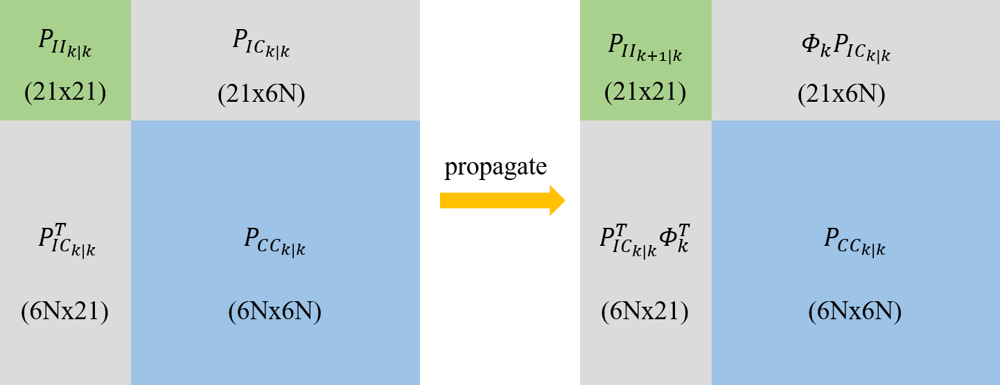

那么对于左上角IMU的corvariance的传播有:
$$
\textbf{P}_{II_{k+1|k}}=\Phi_{k}\textbf{P}_{II_{k|k}}\Phi_{k}^{T}+\textbf{Q}_{k}
\tag{4.11}
$$
其中Camera的covariance暂时还没有变化是因为这个时间段图像还没有到来,只有IMU的影响,但是会影响到IMU与Camera协方差,即上图灰色矩形块. 

##### B. 增广

　　当图像到来时,需要对当前相机姿态做增广,这个时刻的相机姿态是由上一时刻的IMU propagate的结果结合外参得到的:

$$
_{G}^{C}\hat{\textbf{q}}=_{I}^{C}\hat{\textbf{q}}\otimes _{G}^{I}\hat{\textbf{q}} \\
^{G}\hat{\textbf{p}}_{C} = ^{G}\hat{\textbf{p}}_{I} + C(_{G}^{I}\hat{\textbf{q}})^{T} \cdot{^{I}\hat{\textbf{p}}_{C}}
\tag{4.12}
$$
假设上一时刻共有N个相机姿态在状态向量中,那么当新一帧图像到来时,这个时候整个滤波器的状态变成了$21+6(N+1)$的向量, 那么它对应的covariance维度变为 $(21+6(N+1))\times(21+6(N+1))$ .其数学表达式为:
$$
\textbf{P}_{k|k}=\begin{pmatrix}
\textbf{I}_{21+6N}\\ 
\textbf{J}
\end{pmatrix}\textbf{P}_{k|k}\begin{pmatrix}
\textbf{I}_{21+6N}\\ 
\textbf{J}
\end{pmatrix}^{T}
\tag{4.13}
$$
这个过程对应如下图过程:

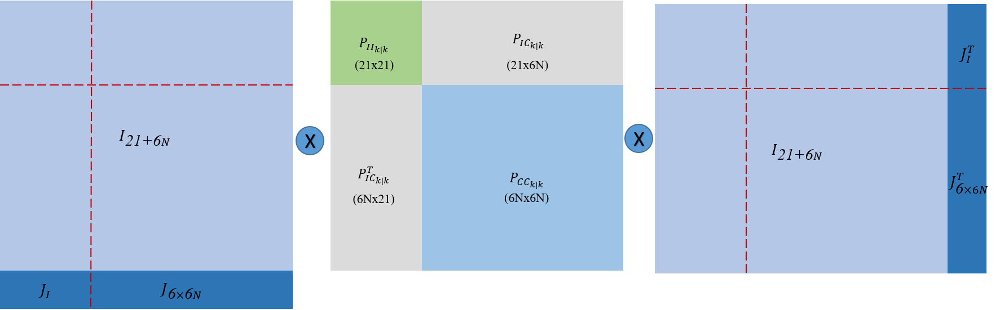

其中$J$ 的详细推导过程见附录B.

##### C.观测模型

　　MSCKF的观测模型是以特征点为分组的,我们可以知道一个特征(之前一直处于跟踪成功状态)会拥有多个Camera State.所有这些对于同一个3D点的Camera State都会去约束观测模型. 那这样其实隐式的将特征点位置从状态向量中移除,取而代之的便是Camera State. 我们考虑单个feture $f_{j}$, 假设它所对应到 $M_{j}$ 个相机姿态 $(_{G}^{C_{i}}\textbf{q}, ^{G}\textbf{p}_{C_{i}}), i \in j$. 当然双目版本的包含左目和右目两个相机姿态, $(_{G}^{C_{i,1}}\textbf{q}, ^{G}\textbf{p}_{C_{i,1}})$ 和 $(_{G}^{C_{i,2}}\textbf{q}, ^{G}\textbf{p}_{C_{i,2}})$ 右相机很容易能通过外参得到. 其中双目的观测值可以表示如下:
$$
\textbf{z}^{j}_{i}=\begin{pmatrix}
u^{j}_{i,1}\\ 
v^{j}_{i,1}\\ 
u^{j}_{i,2}\\ 
v^{j}_{i,2}
\end{pmatrix}
= \begin{pmatrix}
\frac{1}{^{C_{i,1}}Z_{j}} & \textbf{0}_{2\times 2} \\ 
\textbf{0}_{2\times 2} & \frac{1}{^{C_{i,2}}Z_{j}}
\end{pmatrix}
\begin{pmatrix}
\frac{1}{^{C_{i,1}}X_{j}}\\ 
\frac{1}{^{C_{i,1}}Y_{j}}\\ 
\frac{1}{^{C_{i,2}}X_{j}}\\ 
\frac{1}{^{C_{i,2}}Y_{j}}
\end{pmatrix}
\tag{4.14}
$$
而特征点在两个相机坐标系下可以分别表示为:
$$
\begin{split}
^{C_{i,1}}\textbf{p}_{j}=\begin{pmatrix}
^{C_{i,1}}X_{j}\\ 
^{C_{i,1}}Y_{j}\\ 
^{C_{i,1}}Z_{j}
\end{pmatrix}
= C(^{C_{i,1}}_{G} \textbf{q})(^{G}\textbf{p}_{j}-^{G}\textbf{p}_{C_{i,1}})\\
^{C_{i,2}}\textbf{p}_{j}=\begin{pmatrix}
^{C_{i,2}}X_{j}\\ 
^{C_{i,2}}Y_{j}\\ 
^{C_{i,2}}Z_{j}
\end{pmatrix}
= C(^{C_{i,2}}_{G} \textbf{q})(^{G}\textbf{p}_{j}-^{G}\textbf{p}_{C_{i,2}})\\
=C(^{C_{i,2}}_{C_{i,1}} \textbf{q})(^{C_{i,1}}\textbf{p}_{j}-^{C_{i,1}}\textbf{p}_{C_{i,2}})
\end{split}
\tag{4.15}
$$
其中 $^{G}\textbf{p}_{j}$ 是特征点在惯性系下的坐标,这个是通过这个特征点的对应的所有camera state三角化得到的结果. 将观测模型在当前状态线性化可以得到如下式子:
$$
\textbf{r}^{j}_{i}=\textbf{z}^{j}_{i}-\hat{\textbf{z}}^{j}_{i}=
\textbf{H}^{j}_{C_{i}}\tilde{\textbf{x}}_{C_{i}}+ \textbf{H}^{j}_{f_{i}}\tilde{\textbf{p}}_{j}+\textbf{n}^{j}_{i}
\tag{4.16}
$$
其中 $\textbf{n}^{j}_{i}$是观测噪声, $\textbf{H}^{j}_{C_{i}}$和 $\textbf{H}^{j}_{f_{i}}$ 是对应的雅克比矩阵.其详细推导和解析见附录C. 式子(4.16)对应到的是单个特征点对应的其中某一个相机姿态, 但是这个特征点会对应到很多相机姿态,我们直接将它贴在后边可以得到一个特征点的残差模型为:
$$
\textbf{r}^{j}=
\textbf{H}^{j}_{\textbf{x}}\tilde{\textbf{x}}+ {\color{Red} \textbf{H}^{j}_{f}\tilde{\textbf{p}}_{j}}+\textbf{n}^{j}
\tag{4.17}
$$
但是这个其实并不是一个标准的EKF观测模型,因为我们知道 $\tilde{\textbf{p}}_{j}$ 并不在我们的状态向量里边,所以做法是将式子(4.17)中红色部分投影到零空间, 假设 $\textbf{H}^{j}_{f}$ 的[left null space](https://blog.csdn.net/liuheng0111/article/details/52522845) 为$\textbf{V}^{T}$, 即有$\textbf{V}^{T}\textbf{H}^{j}_{f}=\textbf{0}$, 所以式(4.17)可有写成:
$$
\textbf{r}_{o}^{j}=
\textbf{V}^{T}\textbf{H}^{j}_{\textbf{x}}\tilde{\textbf{x}}+\textbf{V}^{T}\textbf{n}^{j}=\\
\textbf{H}^{j}_{\textbf{x,o}}\tilde{\textbf{x}}+\textbf{n}^{j}_{o}
\tag{4.18}
$$
式(4.18)则是一个标准的EKF观测模型了,下面简单分析一下维度.分析时针对单个特征点, 我们知道 $\textbf{H}^{j}_{f}$ 的维度是 $4M_{j}\times 3 $, 那么它的left null space的维度即$\textbf{V}^{T}$ 的维度为 $(4\textbf{M}_{j} - 3)\times 4\textbf{M}_{j}$, 则最终 $\textbf{H}^{j}_{\textbf{x,o}}\tilde{\textbf{x}}$的维度变为 $(4\textbf{M}_{j} - 3)\times 6$, 残差的维度变为 $(4\textbf{M}_{j} - 3)\times 1$, 假设一共有L个特征的话,那最终残差的维度会是 $L(4\textbf{M}_{j} - 3)\times 1$. 更多详细的代码细节见给到的注释版代码,然后H矩阵的详细推导见附录C.

#### 4.2 三角化

　　三角化是通过多帧相机对同一个点的观测计算出特征点在世界坐标系下的绝对3D坐标,或者你可以认为是恢复出一个比较可靠的3D点. 在讲这个之前,我们先来简单过一下相机的投影模型, 假设相机图像已经去畸变了,那么我们很容易得到这样一个模型:
$$
\begin{bmatrix}
u\\ 
v
\end{bmatrix}
=h\begin{pmatrix}
X/Z\\ 
Y/Z
\end{pmatrix}=
\begin{bmatrix}
f_{x} & 0\\ 
0 & f_{y}
\end{bmatrix}
\begin{bmatrix}
X/Z\\ 
Y/Z
\end{bmatrix}
+\begin{bmatrix}
c_{x}\\ 
c_{y}
\end{bmatrix}
\tag{4.19}
$$
其中(X,Y,Z)为相机坐标系下的一个点. 我们再来看下图:

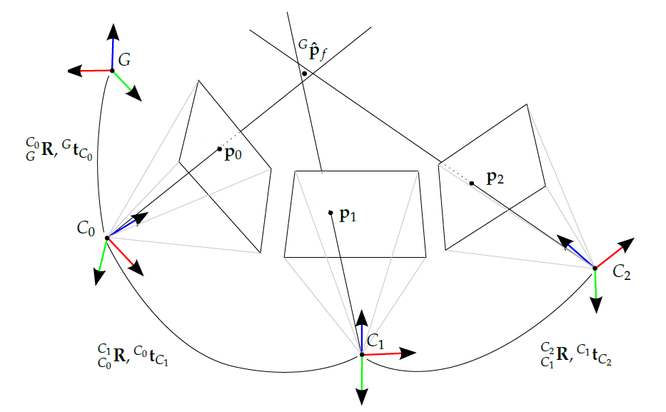

其中在惯性系下 $^{G}\hat{\textbf{p}}_{f}$ 被多帧相机观测到,其中在每个相机下的坐标表示为 $^{C_{i}}\textbf{p}_{f} = (^{C_{i}}X, ^{C_{i}}Y, ^{C_{i}}Z)^{T}$, 假设该特征第一个观测为 $^{C_{0}}\textbf{p}$, 余数在第 $i$个相机帧中可以表示为:
$$
^{C_{i}}\textbf{p}_{f} = ^{C_{i}}_{C_{0}}\textbf{R}^{C_{0}}\textbf{p}_{f} + ^{C_{i}}\textbf{p}_{C_{0}}
\tag{4.20}
$$
我们将这个转换为逆深度的表达形式,可以得到下面一系列式子:
$$
^{C_{i}}\textbf{p}_{f} = ^{C_{i}}_{C_{0}}\textbf{R}
\begin{bmatrix}
^{C_{0}}X\\ 
^{C_{0}}Y\\ 
^{C_{0}}Z
\end{bmatrix}
 + ^{C_{i}}\textbf{p}_{C_{0}}\\
=^{C_{0}}Z(^{C_{i}}_{C_{0}}\textbf{R}
\begin{bmatrix}
^{C_{0}}X / ^{C_{0}}Z\\ 
^{C_{0}}Y/ ^{C_{0}}Z \\
1
\end{bmatrix}+
\frac{1}{^{C_{0}}Z} \cdot ^{C_{i}}\textbf{p}_{C_{0}}
)\\
=\frac{1}{\rho } \textbf{g}_{i}(^{C_{i}}_{C_{0}}\textbf{R}
\begin{bmatrix}
\alpha \\ 
\beta \\ 
1 
\end{bmatrix}+\rho ^{C_{i}}\textbf{p}_{C_{0}}
)\\
=\frac{1}{\rho }\textbf{g}_{i}(\begin{bmatrix}
\alpha \\ 
\beta \\ 
\rho 
\end{bmatrix})
=\frac{1}{\rho }\textbf{g}_{i}(\theta)
\tag{4.21}
$$
其中$\theta$ 为参数, $\alpha=^{C_{0}}X/^{C_{0}}Z$, $\beta=^{C_{0}}Y/^{C_{0}}Z$, $\rho=1/^{C_{0}}Z$.

并且这个假设我们的$^{C_{i}}\textbf{p}_{f}$ 为$(^{C_{i}}X / ^{C_{i}}Z, ^{C_{i}}Y/^{C_{i}}Z)^{T})$, 那么就是说$g_{i}(\theta)$是一个3维输入,二维输出的函数. 所以误差函数可以写成:
$$
f_{i}(\theta)=\textbf{z}_{i}-h(g_{i}(\theta))
\tag{4.22}
$$
假设一共共有N个相机观测,那么我们可以构建一个最小二乘问题,形如下式:
$$
arg\:  min\sum_{i=1}^{n}\left \| f_{i}(\theta) \right \|_{2}
\tag{4.23}
$$
其中对应于单个特征点的$Jocabian$形式如下:
$$
J_{f}=\frac{\partial f }{\partial \theta}=\frac{\partial h }{\partial g}\frac{\partial g }{\partial \theta}
\tag{4.24}
$$
其中第一项 $\frac{\partial f }{\partial g}$非常简单,就是参考式(4,19), 得到的结果第比较简单,第二部分$\frac{\partial g}{\partial \theta}$ 根据式子(4.21)可以很容易得到
$$
\frac{\partial g}{\partial \theta}=\begin{bmatrix}
\frac{\partial g_{i}}{\partial \alpha} & \frac{\partial g_{i}}{\partial \beta} & \frac{\partial g_{i}}{\partial \rho}
\end{bmatrix}\\
=
[^{C_{i}}_{C_{0}}R\begin{bmatrix}
1\\ 
0\\ 
0
\end{bmatrix},\:  ^{C_{i}}_{C_{0}}R\begin{bmatrix}
0\\ 
1\\ 
0
\end{bmatrix},\;  ^{C_{i}}\textbf{p}_{C_{0}}]
\tag{4.25}
$$
然后用高斯-牛顿法就可以红容易解决这个最小二乘问题. 最后能得到$\hat{\theta}=[\hat{\alpha}, \hat{\beta}, \hat\rho]$, 那么其实也就是特征点在首个观测到它的相机帧下的坐标,根据下面的式子则很容易恢复出惯性系下的特征点的位置:
$$
^{G}\hat{\textbf{p}}_{f}=\frac{1}{\hat{\rho}} \: ^{G}_{C_{0}}\textbf{R}\begin{bmatrix}
\hat{\alpha}\\ 
\hat{\beta}\\ 
1
\end{bmatrix}
+ ^{G}\textbf{p}_{C_{0}}
\tag{4.26}
$$
注意,代码中的实现和现在这个推到稍微有点出入,它的实现主要参考的是文献7,不过基本大同小异,大家阅读起来应该也不会有太大的阻碍.


#### 4.3 能观测性分析

　　<font color=red>关于能观性分析,我个人感觉公式太多了,并且没有想到一个很好的描述方式,理解的也不算太透彻,所以这里还希望有大佬能把这部分写一下,或者单独写一个专题,我觉得那是极好的.</font> 

　　另外开源版本的S-MSCKF用的是OC-EKF, 这个主要参考了这两篇论文 [Consistency Analysis and IMprovement of Vision-aided Inertial Navigation](http://xueshu.baidu.com/s?wd=paperuri:(f308abb33c5a80cd81f674dff09513a2)&filter=sc_long_sign&sc_ks_para=q%3DConsistency+Analysis+and+Improvement+of+Vision-aided+Inertial+Navigation&tn=SE_baiduxueshu_c1gjeupa&ie=utf-8&sc_us=13835246309820327221) 和 [On the consistency of Vision-aided Inertial Navigation](http://xueshu.baidu.com/s?wd=paperuri:(c1627c8837b2165d335c77f39de88f7d)&filter=sc_long_sign&sc_ks_para=q%3DOn+the+Consistency+of+Vision-Aided+Inertial+Navigation&tn=SE_baiduxueshu_c1gjeupa&ie=utf-8&sc_us=7890470351829265780). 代码中的实现主要参考了第二篇的给出的公式,我在注释里应该都有注明.

#### 4.4 滤波器更新机制

　　大致是有两种更新策略,假设新进来一帧图像,这个时候会丢失一些特征点,这个时候丢失的特征点(且三角化成功)用于滤波器更新,如下图所示:

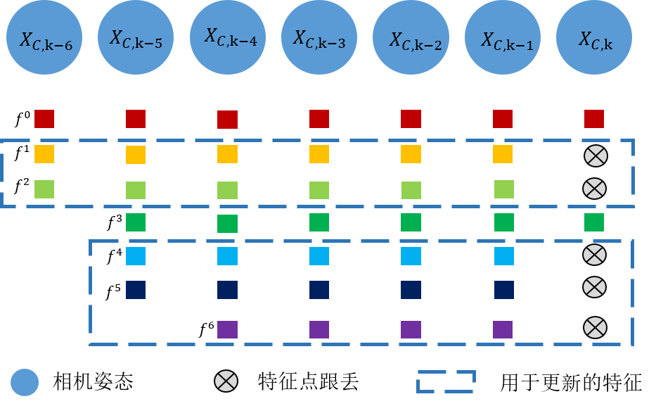

　　那当然随着时间的推移,相机状态会越来越多,这个时候呢, 相机状态会有一个阈值,也就是滑窗的上限, S-MSCKF与msckf1.0有稍微不同,它是当满了之后每次迭代的清除两个,最新的这个状态肯定保持, 清除依据就是帧间的旋转跟位移大小,如下图所示,假设Slide Window的大小正好为7,且已经经过了上面的update过程,那么这个时候还会再update一次,这个时候它的所有特征都会用于更新.因为要移除两个camera state,所以对应的状态和covariance也都需要剔除掉.所以删掉的两个状态其实肯定处于紫色框其中的两个.

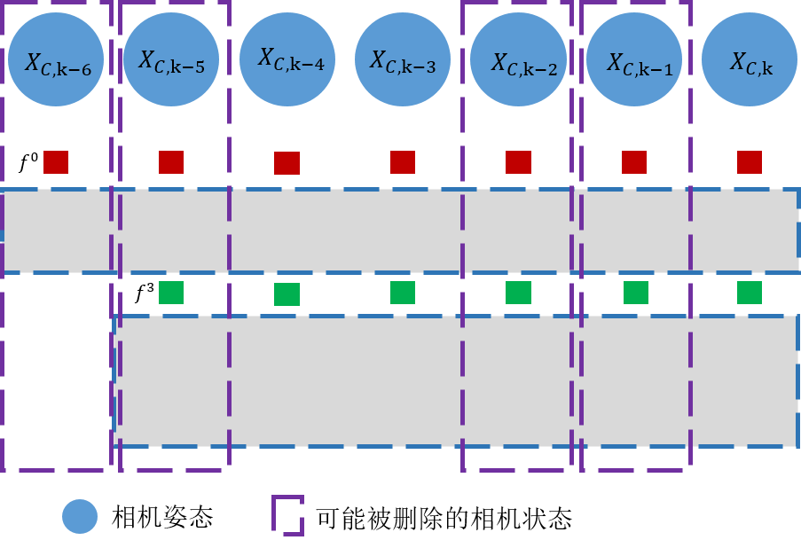

### 5.S-MSCKF代码流程

　　这里放一张之前做的图,清晰图片从这里[下载](下载地址).另外中文注释版本的代码在[这里](这里放github链接)

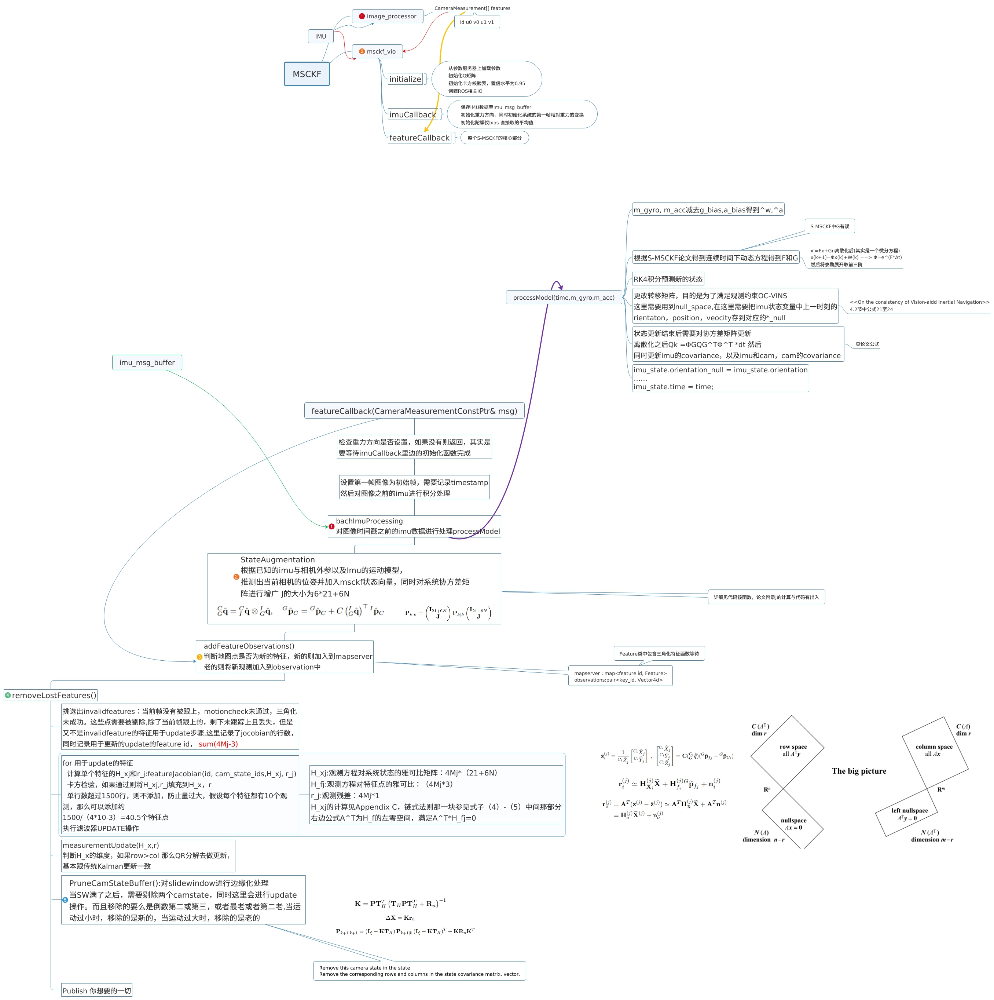

### 6.总结

​	全文以S-MSCKF为依托, 主要对MSCKF的理论基础和实现原理及细节进行了讲述, 并且对论文公式进行了详细的推导(很多手写的地方实在是不想敲了,太费时间了), 然后还对[Quaternion kinematics for the error-state Kalman filter](https://arxiv.org/abs/1711.02508) 这本书进行了详细的注释, 同时对开源版本的S-MSCKF的代码进行了注释. 由于笔者水平有限,有些地方理解难免不到位,其中就包括能观性分析这部分还没有做比较到位的解释,最后希望望读者批评指正文中不足的地方. 

### 附录

#### A. F矩阵和G矩阵的推导

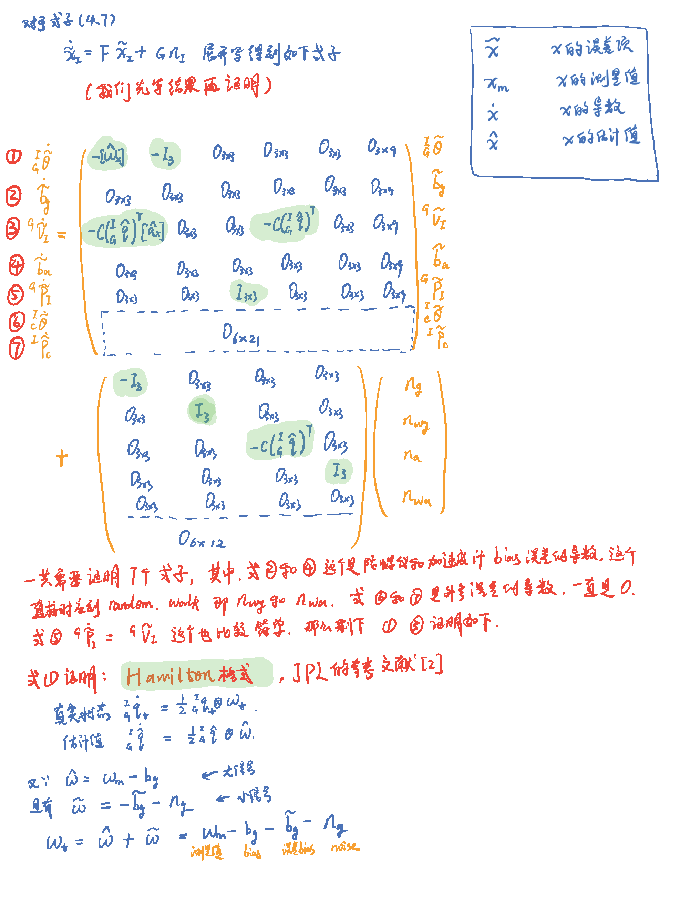

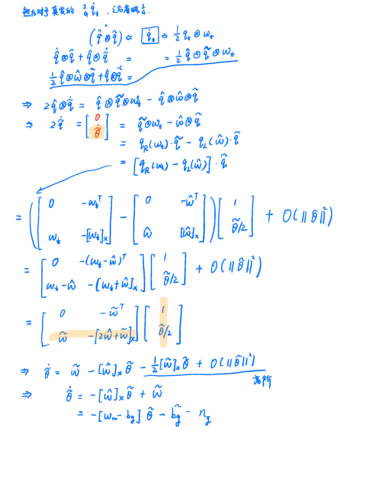

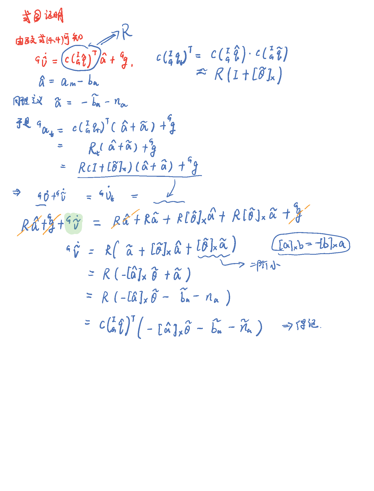

#### B. $J_{I}$的计算

$J_{I}$ 的计算与正文有点出入,但还是先贴上来了,希望哪位大佬能推导得到论文的结果并告知我一下.

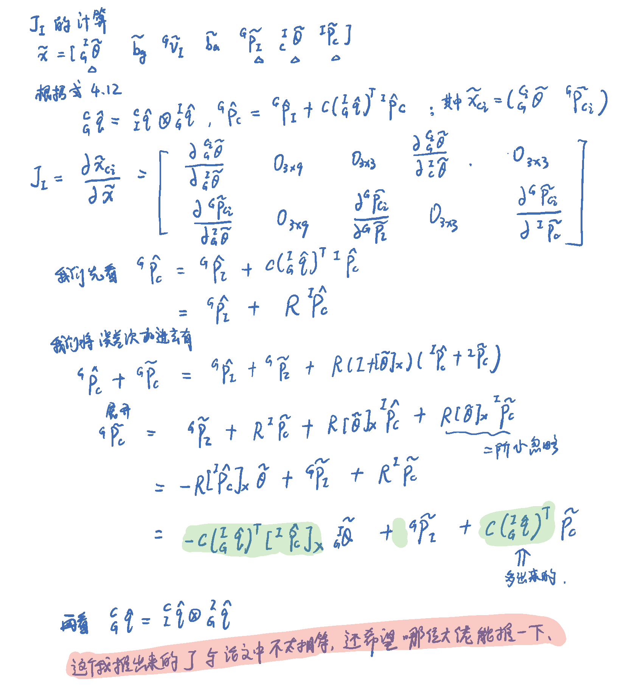

#### C. H矩阵

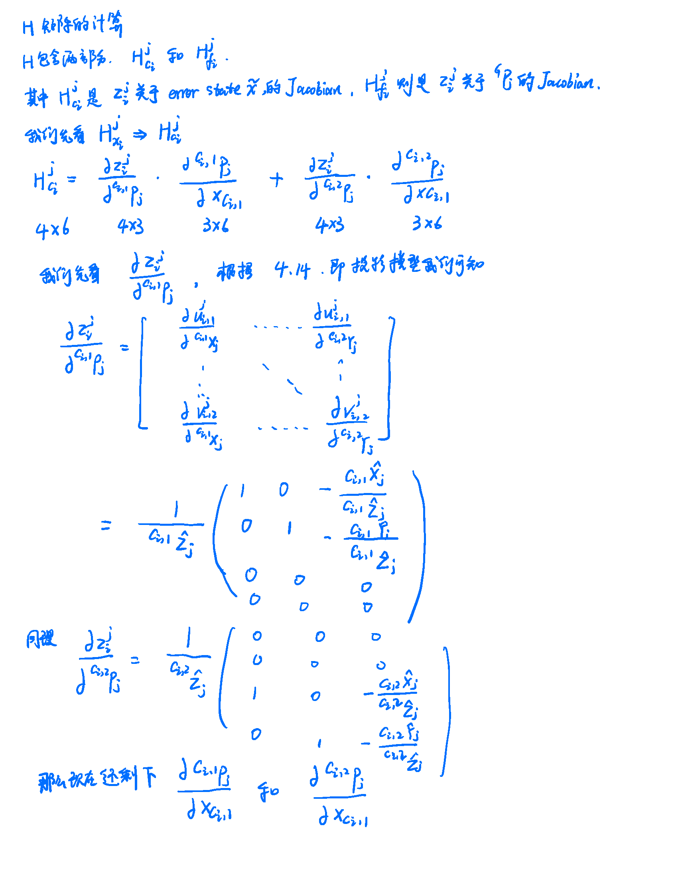

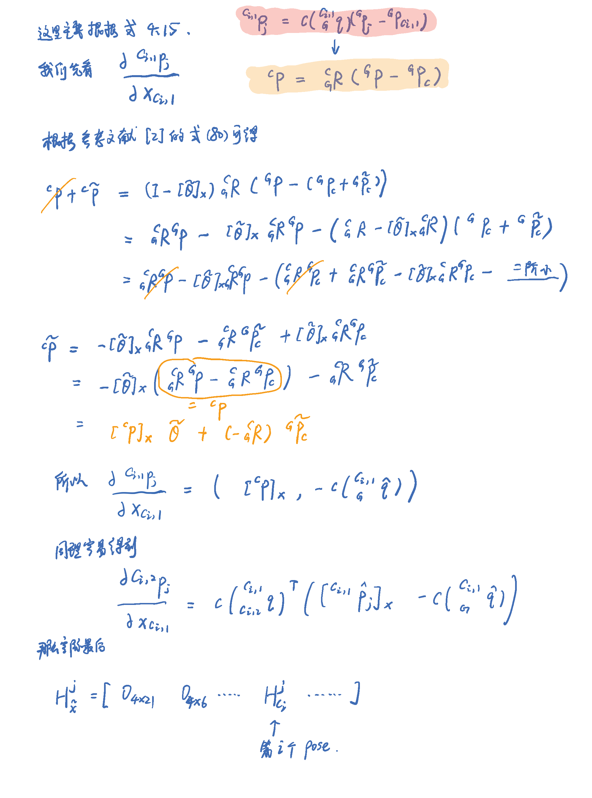

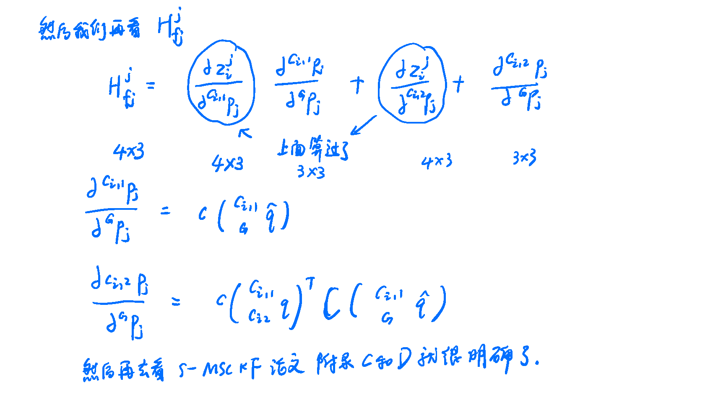

#### D. 三种常用数值积分方式:欧拉,中值,RK4积分

　　这部分其实比较简单, 大家也可以参考 参考文献1中附录A部分,也讲的很详细.这里简单附上三张图,分别对应三种积分方式.

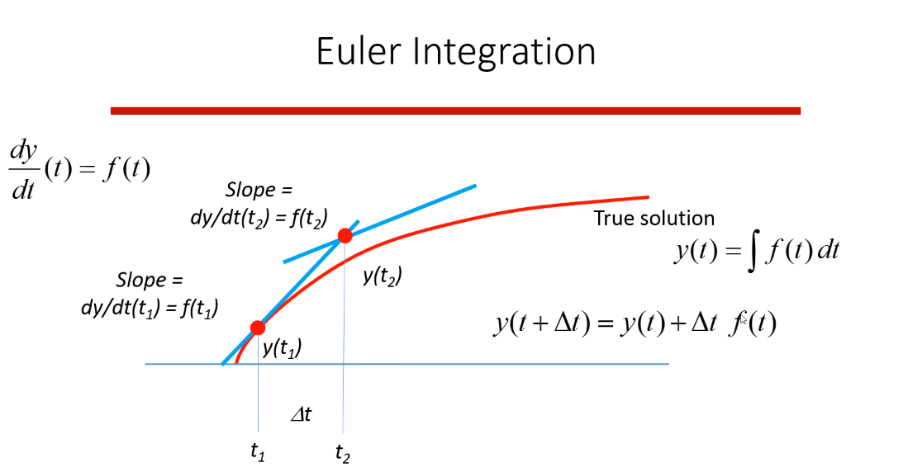

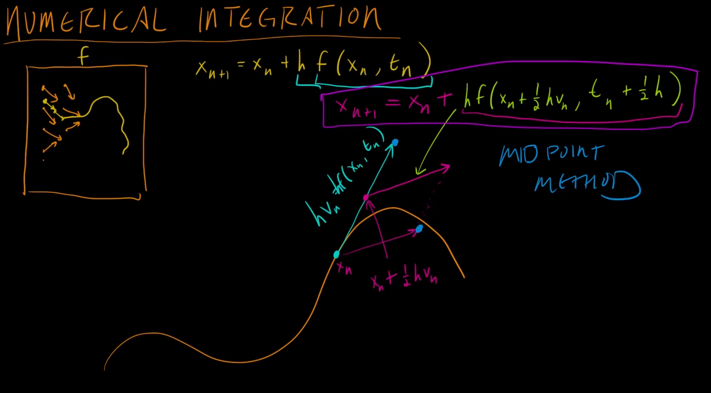

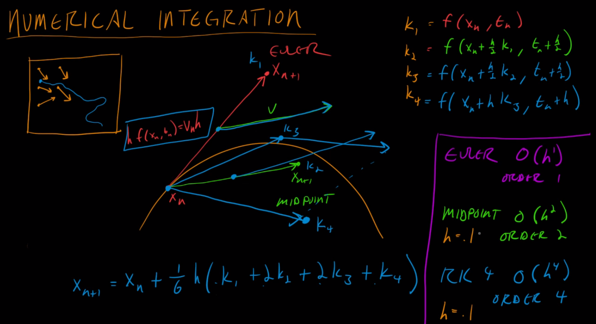

### 7.参考文献

(1) [Quaternion kinematics for the error-state Kalman filter](https://arxiv.org/abs/1711.02508)

(2) [Indirect Kalman Filter for 3D Attitude Estimation-A Tutorial for Quaternion Algebra](http://citeseerx.ist.psu.edu/viewdoc/download?doi=10.1.1.304.6207&rep=rep1&type=pdf)

(3) [Consistency Analysis and IMprovement of Vision-aided Inertial Navigation](http://xueshu.baidu.com/s?wd=paperuri:(f308abb33c5a80cd81f674dff09513a2)&filter=sc_long_sign&sc_ks_para=q%3DConsistency+Analysis+and+Improvement+of+Vision-aided+Inertial+Navigation&tn=SE_baiduxueshu_c1gjeupa&ie=utf-8&sc_us=13835246309820327221)

(4) [On the consistency of Vision-aided Inertial Navigation](http://xueshu.baidu.com/s?wd=paperuri:(c1627c8837b2165d335c77f39de88f7d)&filter=sc_long_sign&sc_ks_para=q%3DOn+the+Consistency+of+Vision-Aided+Inertial+Navigation&tn=SE_baiduxueshu_c1gjeupa&ie=utf-8&sc_us=7890470351829265780).

(5) [Robust Stereo Visual Inertial Odometry for Fast Autonomous Flight](https://arxiv.org/abs/1712.00036)

(6) [Monocular Visual Inertial Odometry on a Mobile Device](http://xueshu.baidu.com/s?wd=paperuri:(68dda4a4688ea361c151eab22dedbe17)&filter=sc_long_sign&sc_ks_para=q%3DMonocular+Visual+Inertial+Odometry+on+a+Mobile+Device&tn=SE_baiduxueshu_c1gjeupa&ie=utf-8&sc_us=7517713721102109000)

(7) [A multi-state constraint Kalman filter for vision-aided inertial navigation](http://xueshu.baidu.com/s?wd=paperuri:(fc81955af6e11c8b7d738d8ef94b512d)&filter=sc_long_sign&sc_ks_para=q%3DA+Multi-State+Constraint+Kalman+Filter+for+Vision-aided+Inertial+Navigation&tn=SE_baiduxueshu_c1gjeupa&ie=utf-8&sc_us=10867325448677835818)

(8) [视觉SLAM十四讲](https://baike.baidu.com/item/%E8%A7%86%E8%A7%89SLAM%E5%8D%81%E5%9B%9B%E8%AE%B2/20786239?fr=aladdin)

(9)  [卡尔曼滤波与组合导航原理](https://baike.baidu.com/item/%E5%8D%A1%E5%B0%94%E6%9B%BC%E6%BB%A4%E6%B3%A2%E4%B8%8E%E7%BB%84%E5%90%88%E5%AF%BC%E8%88%AA%E5%8E%9F%E7%90%86/12130448?fr=aladdin)


